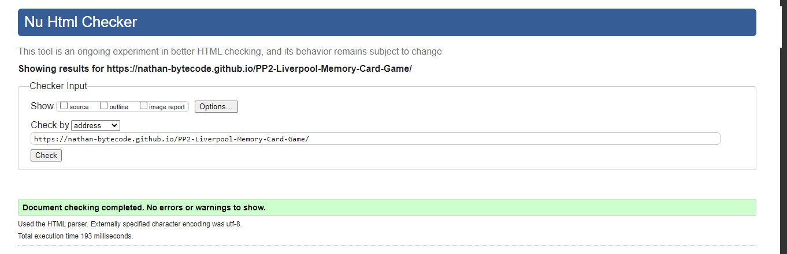

# Liverpool Memory Card Game

This project is a memory card game. The user's aim is to match all 6 pairs of Liverpool football players. A timer is set to a start button to test how fast the user completes the task. A move counter is also on display.

This project is aimed to target all who are Liverpool Football Club fans and like to have fun.

[Here's a link to my live site](https://nathan-bytecode.github.io/PP2-Liverpool-Memory-Card-Game/)

## Table of Content

### UX

### Features

Features include a memory card game theme in a Liverpool Football Club style. Front face of a card is a Liverpool football player to be paired. Back face of the cards is the Liverpool Football Club badge. Cards are shuffled upon restart. A move counter is displayed upon every second selection. A time counter button is optional to add a further challeneg to the user. 

Social Meida icons are also on display to enable a user to contact for further support or issues.

#### Future Features
If I had more time I would've json extract all my images so that html code would be smaller and more tidy. 

If time permitted I also would have included the following:
1. Introduction screen wrap, game screen wrap and end game wrap.
2. Give the user the option to enter name and record their score.
3. Have an optional sound track play/pause button to play Liverpool's anthem.

### Testing

#### For testing if my JavaScript dode is validated I used JSHint. I did not have time to implement the changes needed but could see that there were no serious errors with my functions.

Testing 1

Testing 2

Testing 3

#### For testing if my HTML code is validated I used ValidatorW3.

Testing 1

Testing 2

### Development and Deployment
The site was deployed to GitHub pages. The steps to deploy are as follows: In the GitHub repository, navigate to the Settings tab From the source section drop-down menu, select the Master Branch Once the master branch has been selected, the page will be automatically refreshed with a detailed ribbon display to indicate the successful deployment.

### Content

### Design

### Credits

## Technologies Used

HTML, CSS and JavaScript

